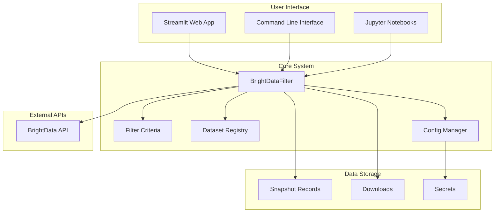

# BrightData Manager

A comprehensive **open-source** Python library and web application for accessing and filtering data using the BrightData API across multiple datasets. This system provides intuitive, type-safe database queries with built-in support for Amazon Products, Amazon-Walmart Comparison, Shopee Products, and other datasets, plus a complete snapshot management system for handling long-running database operations.

[](https://opensource.org/licenses/MIT)
[](https://www.python.org/downloads/)
[](https://streamlit.io/)

## 🌟 Key Features

### 🎯 **Multi-Dataset Support**
- **Amazon Products** - Comprehensive product data with pricing, reviews, and availability
- **Amazon-Walmart Comparison** - Cross-platform competitive analysis
- **Shopee Products** - Southeast Asian e-commerce data
- **TikTok Products** - Social commerce insights
- **Target Products** - US retail data

### 🔧 **Advanced Query System**
- **Visual Query Builder** - Intuitive web interface for creating complex filters
- **Type-Aware Filtering** - Automatic validation and type checking
- **Nested Logic Groups** - Support for complex AND/OR logic combinations
- **Smart Deduplication** - Prevents duplicate API calls with order-independent matching
- **Real-time Preview** - See your query structure before submission

### 📊 **Snapshot Management**
- **Long-running Query Support** - Handle queries that take hours to complete
- **Status Monitoring** - Real-time tracking of query progress
- **Download Management** - Safe, cost-aware data downloads
- **Local Storage** - Persistent records of all submissions
- **Metadata Management** - Custom titles and descriptions for snapshots

### 🖥️ **Modern Web Interface**
- **Multi-page Streamlit App** - Clean, organized interface
- **Query Builder** - Visual filter construction
- **Snapshot Viewer** - Data analysis and visualization
- **Settings Management** - API key and configuration
- **Responsive Design** - Works on desktop and mobile

## 🚀 Quick Start

### 1. Installation

```bash
# Clone the repository
git clone https://github.com/yourusername/brightdata-manager.git
cd brightdata-manager

# Install dependencies
pip install -r requirements.txt
pip install -r requirements_ui.txt
```

### 2. Configuration

```bash
# Copy the example configuration
cp secrets.example.yaml secrets.yaml

# Edit secrets.yaml with your BrightData API key
# You can get an API key from https://brightdata.com/
```

### 3. Launch the Application

```bash
# Launch the web interface
python launch_viewer.py

# Or run directly with Streamlit
streamlit run app.py
```

### 4. Basic Usage

```python
from util import BrightDataFilter

# Initialize with dataset name (recommended)
amazon_products = BrightDataFilter("amazon_products")

# Create a simple filter
F = amazon_products.filter
query = (F.rating >= 4.5) & (F.reviews_count > 100)

# Submit the query
snapshot_id = amazon_products.search_data(
    filter_obj=query,
    records_limit=1000,
    description="High-rated products with many reviews"
)

print(f"Query submitted! Snapshot ID: {snapshot_id}")
```

## 🏗️ Architecture

### System Components



## 📖 Documentation

### Core Concepts

- **[Architecture Overview](docs/architecture.md)** - System design and components
- **[Technical Specifications](docs/technical.md)** - Detailed technical documentation
- **[API Reference](docs/api_reference.md)** - Complete API documentation
- **[Examples](examples/)** - Usage examples and tutorials

### User Guides

- **[Getting Started](docs/getting_started.md)** - Step-by-step setup guide
- **[Query Builder Guide](docs/query_builder.md)** - How to use the visual query builder
- **[Snapshot Management](docs/snapshot_management.md)** - Working with snapshots
- **[Configuration](docs/configuration.md)** - System configuration options

## 🎯 Use Cases

### E-commerce Research
- **Product Analysis** - Find trending products and market opportunities
- **Competitive Intelligence** - Compare prices and availability across platforms
- **Market Research** - Analyze customer reviews and ratings
- **Inventory Planning** - Identify stockout opportunities

### Data Science
- **Machine Learning** - Train models on product and review data
- **Statistical Analysis** - Perform market research and trend analysis
- **Data Visualization** - Create charts and dashboards
- **Research Projects** - Academic and commercial research

### Business Intelligence
- **Market Analysis** - Understand market trends and opportunities
- **Competitor Analysis** - Track competitor pricing and products
- **Customer Insights** - Analyze customer behavior and preferences
- **Strategic Planning** - Make data-driven business decisions

## 🔧 Advanced Usage

### Complex Queries

```python
from util import BrightDataFilter

# Initialize filter
amazon_products = BrightDataFilter("amazon_products")
F = amazon_products.filter

# Complex nested query
query = (
    (F.rating >= 4.0) & 
    (F.reviews_count > 50) &
    (F.price.between(10, 100)) &
    (F.category.in_list(["Electronics", "Books"]))
)

# Submit with custom metadata
snapshot_id = amazon_products.search_data(
    filter_obj=query,
    records_limit=5000,
    description="High-quality electronics and books under $100",
    title="Premium Products Analysis"
)
```

### Batch Processing

```python
# Process multiple queries
queries = [
    {"filter": F.rating >= 4.5, "limit": 1000, "desc": "Top rated products"},
    {"filter": F.price < 50, "limit": 2000, "desc": "Budget products"},
    {"filter": F.reviews_count > 1000, "limit": 500, "desc": "Popular products"}
]

results = []
for query in queries:
    snapshot_id = amazon_products.search_data(
        filter_obj=query["filter"],
        records_limit=query["limit"],
        description=query["desc"]
    )
    results.append(snapshot_id)
```

## 🧪 Testing

```bash
# Run all tests
python -m pytest tests/

# Run with coverage
python -m pytest tests/ --cov=util

# Run specific test file
python -m pytest tests/test_brightdata.py -v
```

## 🤝 Contributing

We welcome contributions! Please see [CONTRIBUTING.md](CONTRIBUTING.md) for details.

### Development Setup

1. Fork the repository
2. Clone your fork: `git clone https://github.com/yourusername/brightdata-manager.git`
3. Install dependencies: `pip install -r requirements.txt`
4. Install UI dependencies: `pip install -r requirements_ui.txt`
5. Copy `secrets.example.yaml` to `secrets.yaml` and add your API key
6. Run tests: `python -m pytest tests/`

### Code Style

- Follow PEP 8
- Use type hints
- Add docstrings to functions and classes
- Write tests for new features

## 📄 License

This project is licensed under the MIT License - see the [LICENSE](LICENSE) file for details.

## 🙏 Acknowledgments

- **BrightData** for providing the comprehensive API
- **Streamlit** for the amazing web framework
- **The open source community** for inspiration and contributions

## 📞 Support

- **GitHub Issues** - For bug reports and feature requests
- **GitHub Discussions** - For questions and general discussion
- **Documentation** - Check the [docs/](docs/) directory for detailed guides

## 🚀 Roadmap

### Upcoming Features
- **Additional Datasets** - Support for more e-commerce platforms
- **Advanced Analytics** - Built-in statistical analysis tools
- **API Rate Limiting** - Smart rate limiting and retry logic
- **Data Export** - Export to various formats (Excel, Parquet, etc.)
- **Scheduled Queries** - Automated query execution
- **Collaboration Features** - Share queries and results with team members

---

**Made with ❤️ by the BrightData Manager team**